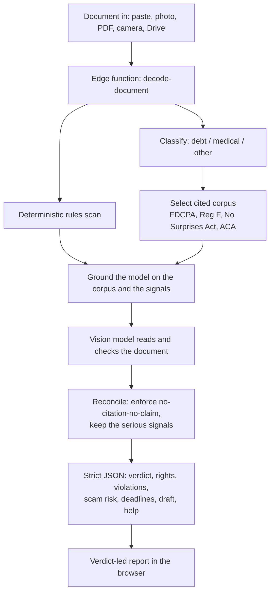
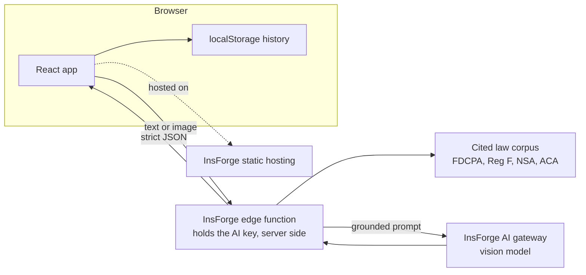
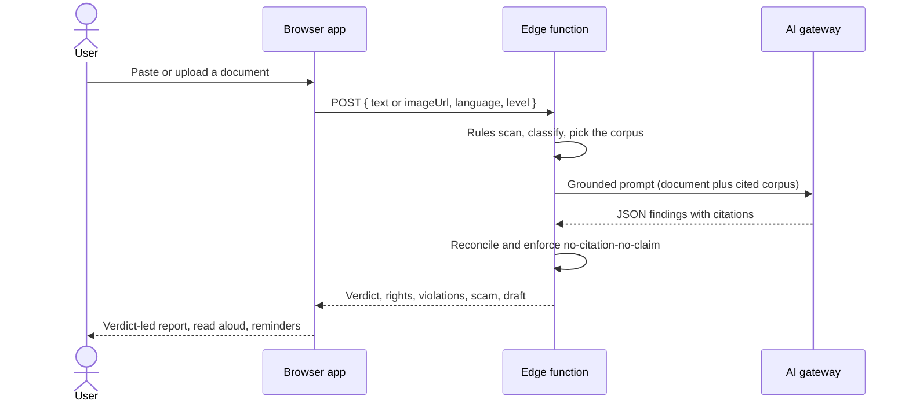

# Decoded

Decoded reads a confusing official document and checks it against real federal law. It explains the letter in plain language, shows your rights, the problems with it, and the scams, with a citation for every legal claim, in your language and read aloud.

Live: https://dgsx9pmv.insforge.site

Decoded explains and checks documents. It is not legal or medical advice, and it routes people to real human help.

## What makes it different

A general chatbot summarizes a scary letter and tells you to pay. It will not tell you the letter is illegal, because it is guessing the law from memory and will not stake a citation on it.

Decoded does not rely on the model's memory of the law. It runs a deterministic rules pass over the letter, then grounds the model on a curated corpus of the actual statutes. The model may only cite by copying from that corpus, so a fabricated citation is impossible. When a collector writes "pay $4,200 in 48 hours or face arrest," Decoded flags the arrest threat as a violation of the Fair Debt Collection Practices Act, notes the missing validation notice, calls out the scam, and tells you that you can demand written verification. Every claim links to the statute.

## How it works



A single vision-grounded call replaces a separate OCR step, extraction step, and translation step. Pairing it with a rules engine and a cited corpus is what turns an explainer into a verifier.

## Architecture



The AI key never reaches the browser. Documents are processed in one edge call and are not stored on a server; saved analyses live on the device.

## A request, end to end



## Bring your document in any way

| Method | Status | How it works |
| --- | --- | --- |
| Paste text | Live | The text goes straight to the edge function. |
| Photo upload | Live | The image is read by the vision model, no separate OCR. |
| Take a picture | In development | Webcam capture with `getUserMedia`, and the camera on mobile. |
| PDF upload | In development | Rendered to an image with pdf.js, then read by the vision model. |
| Google Drive | In development | Picked with the Google Drive Picker, then read like any document. |

## The legal engine

The corpus is the ground truth. Each entry is a plain-language rule with a real citation and a source URL, and the model may cite nothing else.

- Debt-collection letters are checked against the Fair Debt Collection Practices Act and Regulation F: the validation notice, the 30-day dispute right, call-time and frequency limits, the bans on false arrest threats and harassment.
- Medical bills and denials are checked against the No Surprises Act and ACA appeal rights: bans on balance billing for emergency and in-network-facility care, and the 180-day internal and four-month external appeal deadlines.
- Housing and public-benefits verticals, and a "what happens next" legal-procedure timeline, are in active development.

Every right and violation that reaches the screen carries a citation that opens the official statute. A finding that cannot be grounded in the corpus is dropped, never shown as a violation.

## What you get back

A verdict (the risk and what it means), a plain-language summary, the problems with the document each linked to the law, a scam assessment, your rights with citations, the deadlines with one-tap calendar reminders, a checklist, a drafted reply, and a path to real human help. Anything the tool is unsure about is surfaced, not hidden.

## Project structure

```
functions/
  decode-document.ts     Edge function: rules scan, cited corpora, grounded model call, strict JSON
src/
  App.tsx                Hash router (landing or app)
  Landing.tsx            Marketing landing page
  Decoder.tsx            The command deck: input, scan animation, verdict, findings
  index.css              The dark command-deck design system
  main.tsx               Entry
  lib/
    decode.ts            Typed client and the result schema
    tts.ts               Read-aloud (Web Speech API)
    ics.ts               Calendar reminder generation
    history.ts           On-device saved history
    demoFallback.ts      The verified flagship result, used only as a demo safety net
PRD.md                   Product requirements
```

Ingestion modules (PDF, camera, Google Drive, and a shared import panel) are being added under `src/lib` and `src/components`.

## Responsible AI

Decoded explains and checks; it never advises. It never fabricates facts, dates, statutes, amounts, or rights. Citations are not generated from the model's memory; the model may only cite by copying from the curated corpus, so every citation on screen is one a person can open and verify. It surfaces uncertainty, shows a persistent disclaimer, and routes users to real human help such as legal aid, the CFPB, and 211. The AI key stays server-side in the edge function.

## Privacy

There is no account. Saved analyses are stored on the device with localStorage, not on a server. Sensitive documents stay with the person who holds them.

## Run locally

```
npm install
npm run dev
```

The frontend calls the deployed `decode-document` function. To run the function against your own InsForge project, deploy `functions/decode-document.ts`, set `OPENROUTER_API_KEY` as a function secret, and update the function URL in `src/lib/decode.ts`.

## Tech stack

React, TypeScript, Vite, InsForge (edge functions, AI gateway, static hosting), a vision-capable large language model, the Web Speech API. Fonts: Bricolage Grotesque, Inter, JetBrains Mono.

## Roadmap

More input methods (camera, PDF, Google Drive, URL, a QR phone handoff), more cited verticals (housing, public benefits, debt lawsuits), the legal-procedure timeline, deadline math from the document date, and a one-tap "find legal aid near me."

Built for STEMINATE Hacks 2026.
