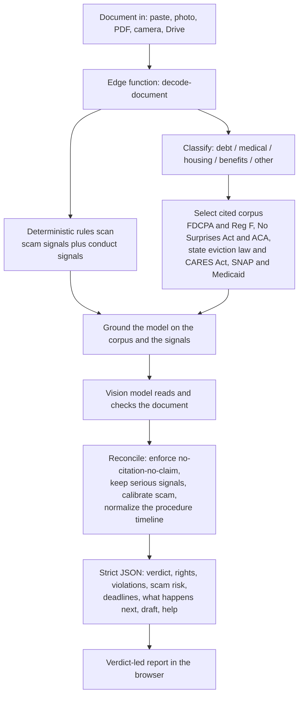
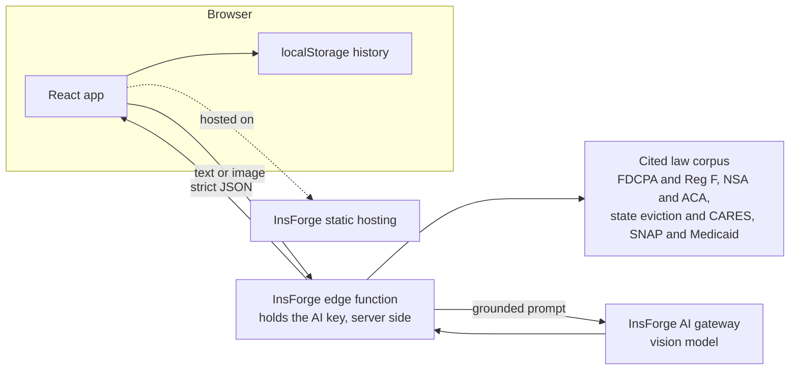
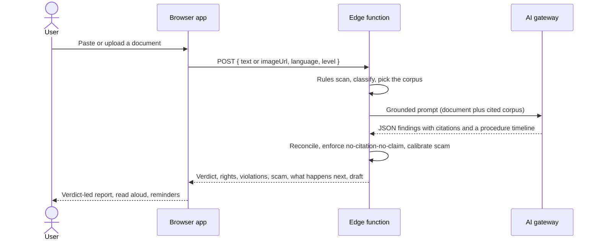
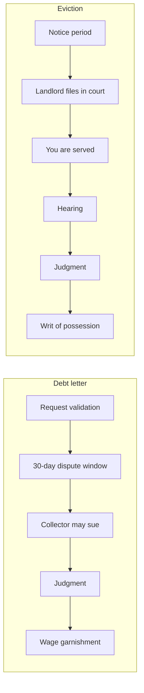

# Decoded

**Decoded reads a confusing official document and checks it against real federal and state law, in plain language, with a citation for every legal claim.**

Decoded is a document comprehension and compliance checker for ordinary people. You paste or photograph a letter you do not understand, a debt-collection demand, a medical bill, an insurance denial, an eviction notice, or a benefits notice, and Decoded returns a calm, plain-language report that explains what the letter is, what it means for you, and whether it actually follows the law. It is built around one principle: it never guesses the law from a model's memory. Every legal statement it shows is copied from a curated corpus of the actual statutes and regulations, so each one carries a citation you can open and verify. Here is how it works, end to end:

- **It classifies the document.** A deterministic classifier routes the letter into one of four cited verticals (debt collection, medical billing, housing and eviction, or public benefits) or marks it as general.
- **It runs a deterministic rules scan first.** Before any model call, a high-precision rules pass looks for hard signals: arrest threats, demands for untraceable payment (gift cards, wire, crypto), requests for sensitive personal data, artificial urgency, illegal self-help eviction, and notices that omit a legally required disclosure. These signals are split into "scam" signals and "conduct" signals so that a real bill is never mislabeled as a scam.
- **It grounds the model on the matching law.** The classifier selects the cited corpus for that vertical and hands it to the model. The model is instructed that it may cite ONLY by copying a citation and source URL verbatim from that corpus, so a fabricated citation is structurally impossible.
- **It checks the document against that law.** The model reads the letter (text or image) and produces a verdict, a plain-language summary, your rights, the concrete violations, a scam assessment, the deadlines, a draft reply, and a "what happens next" legal-procedure timeline.
- **It reconciles model output with the deterministic findings.** A reconciliation pass forces the most serious signals to survive, calibrates the scam meter so a legitimate notice does not read as fraud, surfaces likely illegal conduct as a red flag, and drops any "violation" the model could not ground in a citation.
- **It returns strict, typed JSON.** The browser renders a verdict-led report, reads it aloud, and offers one-tap calendar reminders for deadlines, all on the device, with no account and nothing stored on a server.

Live: https://dgsx9pmv.insforge.site

Decoded explains and checks documents. It is not legal or medical advice, and it routes people to real human help.

## What makes it different

A general chatbot summarizes a scary letter and tells you to pay. It will not tell you the letter is illegal, because it is guessing the law from memory and will not stake a citation on it.

Decoded does not rely on the model's memory of the law. It runs a deterministic rules pass over the letter, then grounds the model on a curated corpus of the actual statutes and regulations. The model may only cite by copying from that corpus, so a fabricated citation is impossible. As a concrete example: when a collector writes "pay $4,200 in 48 hours or face arrest," Decoded flags the arrest threat as a violation of the Fair Debt Collection Practices Act (15 U.S.C. 1692e), notes the missing validation notice (15 U.S.C. 1692g), calls out the untraceable-payment scam signal, tells you that you can demand written verification, and lays out what happens next if you do nothing. Every legal claim links to the statute.

## How it works



A single vision-grounded call replaces a separate OCR step, extraction step, and translation step. Pairing it with a rules engine and a cited corpus is what turns an explainer into a verifier.

## Architecture



The AI key never reaches the browser. Documents are processed in one edge call and are not stored on a server; saved analyses live on the device.

## A request, end to end



## The legal grounding methodology

The corpus is the ground truth. Each entry is a structured record of one rule:

```ts
interface Rule {
  id: string;
  topic: string;
  kind: "required_disclosure" | "prohibited_practice" | "consumer_right" | "timeline";
  rule: string;        // the rule in plain, 8th-grade language
  citation: string;    // the exact statute or regulation, e.g. "FDCPA 15 U.S.C. 1692g(a)"
  source_url: string;  // an official primary source the reader can open
}
```

Four guarantees make the output trustworthy, and they are enforced in code, not left to the model:

1. **Citations are copied, never generated.** The model is told it may use a `citation` and `source_url` only by copying them verbatim from the corpus it was handed. If no corpus entry supports a statement, the citation is null. A statute number the model "remembers" can never reach the screen.
2. **No citation, no claim.** The reconciliation pass drops any item in the `violations` list that is not grounded in a corpus citation. Softer concerns are demoted to `red_flags`, which are clearly labeled as observations rather than legal conclusions.
3. **Scam calibration.** Deterministic signals are split into scam signals (untraceable payment, arrest threats, phishing for identity) and conduct signals (a likely illegal practice or a missing required disclosure). Only a high scam signal raises the scam meter. A real medical bill, a real eviction notice, and a real benefits notice are capped so they never read as fraud, while a likely illegal practice still surfaces as a red flag.
4. **Honesty about uncertainty and state variation.** Where the law is state-specific (eviction and benefits especially), the report says so and keeps numbers general unless the document or corpus supplies them. Anything the tool cannot read or cannot ground is surfaced in `uncertainties`, not filled with a plausible guess.

Every citation in the corpus was verified against a primary source (Cornell Law School's Legal Information Institute, the Electronic Code of Federal Regulations, and official state legislature sites) and every `source_url` is checked to resolve.

## Coverage

Decoded checks four cited verticals today. Federal law is uniform; eviction and benefits are state-fragmented, so the corpus carries a federal baseline plus a set of high-population example states, and the report is explicit that the rule varies by state.

| Vertical | What it is checked against | Examples of what it catches |
| --- | --- | --- |
| Debt collection | Fair Debt Collection Practices Act (15 U.S.C. 1692) and Regulation F (12 CFR 1006) | Missing validation notice, false arrest threats, harassment, third-party disclosure, suing on time-barred debt, your 30-day dispute right, your right to sue (1692k) |
| Medical billing | No Surprises Act (42 U.S.C. 300gg-111, 45 CFR 149) and ACA appeal rights (45 CFR 147.136) | Balance billing for emergency or in-network-facility care, the good-faith estimate, the $400 dispute threshold, the 180-day internal appeal, the 4-month external review, the 72-hour expedited urgent appeal |
| Housing and eviction | State notice law (Texas, California, Massachusetts, Washington) and the federal CARES Act (15 U.S.C. 9058) | The required notice period before an eviction suit, illegal self-help eviction (lockouts, utility shutoffs), the federal 30-day notice for covered dwellings, the absence of a federal right to counsel |
| Public benefits | SNAP fair-hearing rules (7 CFR 273) and Medicaid fair-hearing rules (42 CFR 431) | Your right to a fair hearing, the deadline to request one, the requirement that a denial notice state the reason and the appeal path, and benefits that continue if you appeal in time |

State variation is a first-class concern, not a footnote. For eviction, Texas requires at least a 3-day notice to vacate (Tex. Prop. Code 24.005), California gives 3 court days to pay or quit excluding weekends and holidays (Cal. Code Civ. Proc. 1161(2)), and Massachusetts and Washington both require 14 days for nonpayment (M.G.L. c.186 11-12 and RCW 59.12.030(3)). Decoded tells the reader which rule applies and reminds them to confirm their own state.

## The legal-procedure timeline

Beyond explaining and checking, Decoded answers the question people actually have: what happens next? Every analysis can return an ordered, plain-language timeline grounded only in the corpus.



The result carries two optional fields:

- `procedure`: an ordered list of `{ step, detail }` describing what legally happens next for this document type, grounded in the corpus and never invented. Steps and deadlines that vary by state say so.
- `what_if_ignored`: one honest sentence about the realistic consequence of doing nothing (for example a default judgment, wage garnishment, removal by a sheriff, or loss of benefits), or null when it cannot be grounded.

## What you get back

A verdict (the risk and what it means), a plain-language summary, the problems with the document each linked to the law, a scam assessment, your rights with citations, the deadlines with one-tap calendar reminders, a "what happens next" procedure timeline, an honest line on the cost of doing nothing, a checklist, a drafted reply, and a path to real human help. Anything the tool is unsure about is surfaced, not hidden.

## Bring your document in any way

| Method | Status | How it works |
| --- | --- | --- |
| Paste text | Live | The text goes straight to the edge function. |
| Photo upload | Live | The image is read by the vision model, no separate OCR. |
| Take a picture | In development | Webcam capture with `getUserMedia`, and the camera on mobile. |
| PDF upload | In development | Rendered to an image with pdf.js, then read by the vision model. |
| Google Drive | In development | Picked with the Google Drive Picker, then read like any document. |

## Project structure

```
functions/
  decode-document.ts     Edge function: rules scan, cited corpora, grounded model call, procedure timeline, strict JSON
src/
  App.tsx                Hash router (landing or app)
  Landing.tsx            Marketing landing page
  Decoder.tsx            The command deck: input, scan animation, verdict, findings
  index.css              The dark command-deck design system
  main.tsx               Entry
  lib/
    decode.ts            Typed client and the result schema (DecodeResult, ProcedureStep)
    tts.ts               Read-aloud (Web Speech API)
    ics.ts               Calendar reminder generation
    history.ts           On-device saved history
    demoFallback.ts      The verified flagship result, used only as a demo safety net
PRD.md                   Product requirements
```

Ingestion modules (PDF, camera, Google Drive, and a shared import panel) are being added under `src/lib` and `src/components`.

## Responsible AI

Decoded explains and checks; it never advises. It never fabricates facts, dates, statutes, amounts, or rights. Citations are not generated from the model's memory; the model may only cite by copying from the curated corpus, so every citation on screen is one a person can open and verify. It surfaces uncertainty, shows a persistent disclaimer, and routes users to real human help such as legal aid, the CFPB, a state attorney general, a state insurance regulator, a tenant union or housing legal aid, a state SNAP or Medicaid office, and 211. The AI key stays server-side in the edge function.

## Privacy

There is no account. Saved analyses are stored on the device with localStorage, not on a server. Sensitive documents stay with the person who holds them.

## Terms of use and disclaimer

Decoded is an informational tool. It explains documents and checks them against published law. It does not provide legal advice or medical advice, it does not create an attorney-client or clinician-patient relationship, and it is not a substitute for a licensed professional. The law changes, applies differently to different facts, and varies by state and locality. Before you act, confirm anything important with a qualified attorney, a licensed clinician, or the relevant government agency, and use the human-help resources the report surfaces. Decoded is provided "as is" without warranties of any kind.

## Legal sources and attribution

The cited corpus quotes and links to primary sources of United States law, which are in the public domain. Statutes are cited from the United States Code and state codes; regulations are cited from the Code of Federal Regulations. Source links point to official or authoritative primary sources, including Cornell Law School's Legal Information Institute (law.cornell.edu), the Electronic Code of Federal Regulations (ecfr.gov), the Centers for Medicare and Medicaid Services and HealthCare.gov, and official state legislature sites. Plain-language summaries are Decoded's own rephrasing of those rules for an 8th-grade reading level.

## Run locally

```
npm install
npm run dev
```

The frontend calls the deployed `decode-document` function. To run the function against your own InsForge project, deploy `functions/decode-document.ts`, set `OPENROUTER_API_KEY` as a function secret, and update the function URL in `src/lib/decode.ts`.

## Tech stack

React, TypeScript, Vite, InsForge (edge functions, AI gateway, static hosting), a vision-capable large language model, the Web Speech API. Fonts: Bricolage Grotesque, Inter, JetBrains Mono.

## Roadmap

More input methods (camera, PDF, Google Drive, URL, a QR phone handoff), more cited verticals (debt lawsuits and wage garnishment, utility shutoffs, immigration notices) and more example states for the housing and benefits corpora, deadline math computed from the document date, and a one-tap "find legal aid near me."

Built for STEMINATE Hacks 2026.
